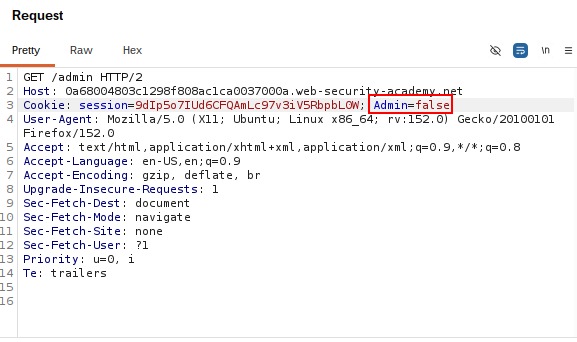
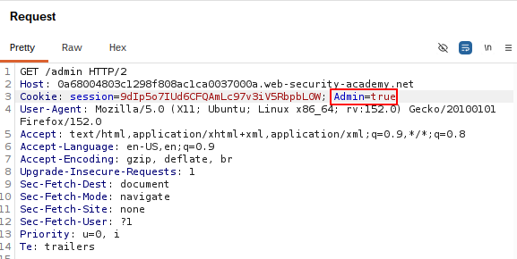

# Access Control via Request Parameter

## Summary

The application contains an access control vulnerability because it trusts a client-side request parameter to determine administrative privileges.

By modifying the `admin` parameter from `false` to `true`, an attacker can bypass authorization and gain unauthorized access to the administration panel.

## Impact

An attacker can modify the request parameter to gain unauthorized administrative access.

This may allow the attacker to perform privileged actions, such as viewing sensitive information, managing users, and deleting user accounts.

## Steps to Reproduce

1. Navigate to the target application.
2. Intercept the request using Burp Suite.
3. Send a GET request to the `/admin` endpoint.
4. Observe the `admin=false` parameter.
5. Modify the parameter to `admin=true`.
6. Forward the modified request.
7. Verify that access to the administration panel is granted.
8. Delete the user `carlos`.

## Proof of Concept (PoC)

### Original Request

The original request contained the `admin=false` parameter.

### Modified Request

The `admin` parameter was modified from `false` to `true`.

### Administration Panel

The modified request granted unauthorized access to the administration panel.

### Delete User

The user `carlos` was successfully deleted after gaining administrative access.

Screenshots showing:

1. The modified GET request.
2. Access to the administration panel.
3. The successful deletion of the user `carlos`.
