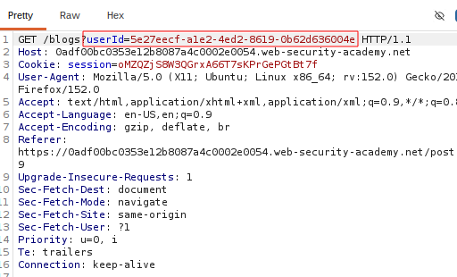
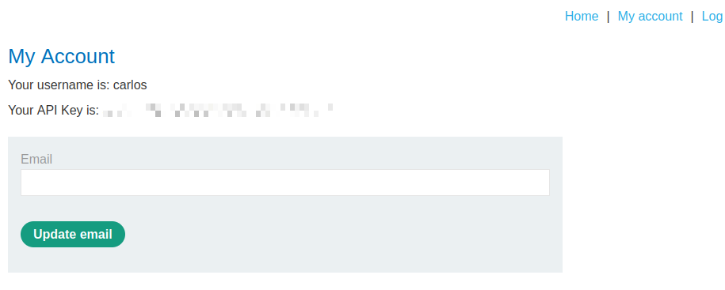

# Broken Access Control via User-Controlled GUID

## Summary

The application contains a Broken Access Control vulnerability because it trusts a user-controlled GUID to determine which user's data should be returned.

By replacing the authenticated user's GUID with another user's GUID, an attacker can access another user's account without proper authorization.

## Impact

An attacker can modify the GUID parameter to gain unauthorized access to another user's account.

This may allow the attacker to access sensitive information, such as the victim's API key.

## Steps to Reproduce

1. Navigate to the target application.
2. Intercept the request using Burp Suite.
3. Visit Carlos's blog post.
4. Identify Carlos's GUID in the URL.
5. Replace your account's GUID with Carlos's GUID.
6. Forward the modified request.
7. Observe that Carlos's account information is displayed.
8. Retrieve Carlos's API key.

## Proof of Concept (PoC)

### User GUID

Carlos's GUID was identified in the URL.

### API Key Exposure

The victim's API key was exposed after accessing Carlos's account.

Screenshots showing:

1. Carlos's GUID in the URL.
2. Unauthorized access to Carlos's account.
3. The exposed API key.
