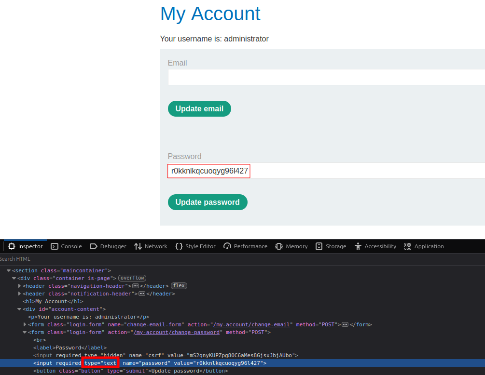
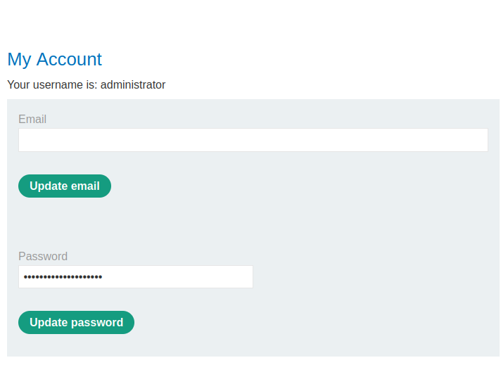

# Broken Access Control via User-Controlled GUID

## Summary

The application contains a Broken Access Control vulnerability because it trusts a user-controlled GUID to determine which user's data should be returned.

By modifying the `userID` parameter and replacing the current user's GUID with another user's GUID, an attacker can access unauthorized user data.

## Impact

An attacker can modify the user-controlled GUID parameter to gain unauthorized access to another user's account.

This may allow the attacker to view sensitive information, such as account credentials, and potentially perform unauthorized actions depending on the application's functionality.

## Steps to Reproduce

1. Navigate to the target application.
2. Log in with a normal user account.
3. Intercept the request using Burp Suite.
4. Identify the user-controlled GUID parameter.
5. Replace the current user's GUID with the administrator's GUID.
6. Forward the modified request.
7. Observe that the administrator's account information is displayed.
8. Modify the password field type from `password` to `text` using Browser DevTools.
9. Retrieve the exposed password.
10. Log in using the administrator credentials.
11. Access the admin panel and delete the user `carlos`.

## Proof of Concept (PoC)

### Administrator ID Disclosure

The administrator user ID was exposed through the application.

### Password Field Modification

The password field type was changed from `password` to `text` using Browser DevTools.

### Exposed Password

The administrator's password was revealed after modifying the password field type.

### Admin Panel Access

The administrator credentials were used to successfully access the admin panel.

Screenshots showing:

1. Carlos's GUID in the URL.
2. Unauthorized access to Carlos's account.
3. The exposed API key.
## Vulnerability Classification

- OWASP Top 10: A01 - Broken Access Control
- Vulnerability Type: IDOR (Insecure Direct Object Reference)

## Remediation

- Do not trust user-controlled identifiers for authorization decisions.
- Implement proper server-side authorization checks.
- Verify that the authenticated user has permission to access the requested resource.
- Use access control mechanisms on every sensitive operation.

## Tools Used

- Burp Suite
- Browser DevTools

