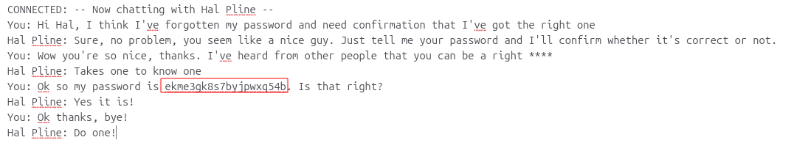

# Broken Access Control via Exposed Chat Logs

## Summary

The application contains a Broken Access Control vulnerability because user chat logs are stored on the server's file system and can be accessed through static URLs without proper authorization checks.

An attacker can access other users' chat logs by discovering the location of these files, which may contain sensitive information such as passwords.

## Impact

An attacker can access unauthorized chat logs belonging to other users.

This may expose sensitive information, including user credentials, which could allow an attacker to take over user accounts.

## Steps to Reproduce

1. Navigate to the target application.
2. Identify the location of the user chat logs.
3. Access the static URL where chat logs are stored.
4. Locate Carlos's chat log.
5. Extract Carlos's password from the exposed chat log.
6. Log in to Carlos's account using the obtained credentials.

## Proof of Concept (PoC)

### Live Chat Log Access

The attacker accessed the live chat logs containing sensitive information.

### Exposed Password in Live Chat

A user's password was exposed through the live chat history.

### Carlos Account Access

The exposed credentials were used to access Carlos's account.

Screenshots showing:

1. The exposed chat log URL.
2. Carlos's chat log containing sensitive information.
3. The extracted password.
4. Successful login to Carlos's account.

