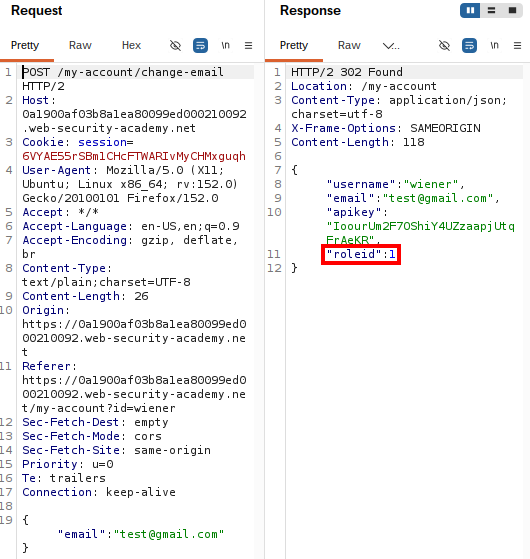
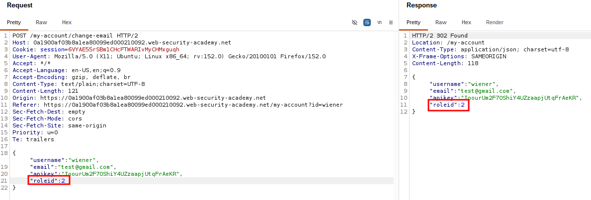

# Broken Access Control via Role ID Manipulation

## Summary

The application contains a Broken Access Control vulnerability because it trusts a user-controlled `roleID` parameter to determine the user's privileges.

By modifying the `roleID` parameter to the administrator role value, an attacker can escalate their privileges and gain unauthorized administrative access.

## Impact

An attacker can modify the user-controlled `roleID` parameter to obtain administrator privileges.

This may allow the attacker to access administrative functionality and perform privileged actions, such as viewing sensitive information or deleting users.

## Steps to Reproduce

1. Navigate to the target application.
2. Log in using a normal user account.
3. Intercept the request using Burp Suite.
4. Identify the user-controlled `roleID` parameter.
5. Modify the `roleID` value to the administrator role ID.
6. Forward the modified request.
7. Verify that administrator privileges have been granted.
8. Access the administrator panel.
9. Delete the user `Carlos`.

## Proof of Concept (PoC)

### Original Role ID Request

The original request contained the default user `roleid` value.

### Modified Role ID Request

The `roleid` parameter was modified to obtain unauthorized administrative privileges.

Screenshots showing:

1. The original request containing the `roleID` parameter.
2. The modified request with the administrator role ID.
3. Unauthorized access to the administrator panel.
4. Successful execution of administrative actions.
