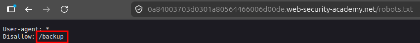

# Information Disclosure via Backup Files

## Summary

The application exposes publicly accessible backup files containing sensitive source code.

The leaked source code reveals sensitive configuration information, including hard-coded database credentials such as the database password.

## Impact

An attacker who obtains the exposed database credentials may be able to access the database if the database service is reachable.

Additionally, leaked source code and configuration details can help attackers understand the application's internal structure and identify potential weaknesses for further attacks.

## Steps to Reproduce

1. Navigate to the target application.
2. Access the `robots.txt` file.
3. Identify the hidden backup directory referenced in the file.
4. Navigate to the discovered backup directory.
5. Access or download the exposed source code file.
6. Review the leaked source code.
7. Identify the hard-coded database credentials.

## Proof of Concept (PoC)
### Exposed Backup Directory

### Leaked Source Code

The screenshot has been redacted to hide sensitive information.

Screenshots showing:

1. The `robots.txt` file revealing the backup directory.
2. The exposed backup file.
3. The source code containing the leaked database credentials.

## Remediation

- Remove backup files from publicly accessible web directories.
- Disable directory access to sensitive files.
- Avoid storing credentials directly in source code.
- Use secure secret management solutions or environment variables for sensitive credentials.
