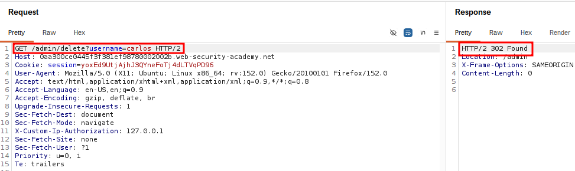
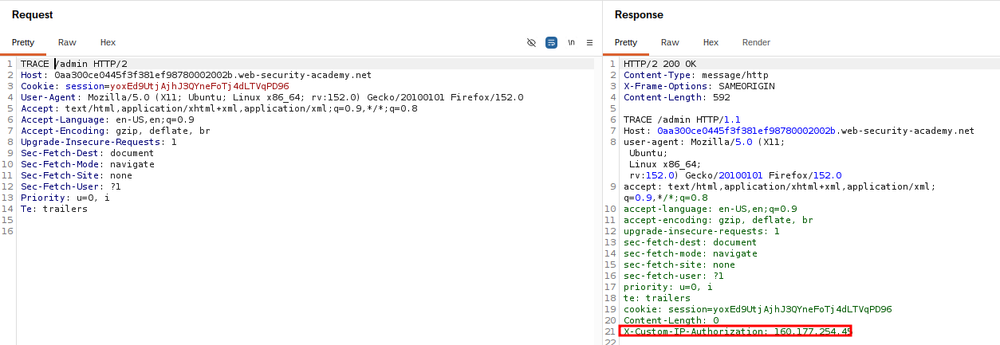

# Authentication Bypass via Custom HTTP Header

## Summary

The application contains an authentication bypass vulnerability in the administration interface.

The vulnerability occurs because the application trusts a custom HTTP header provided by the client to determine whether the user has administrative privileges.

By identifying and adding the required custom HTTP header to the request, an attacker can bypass authentication controls and gain access to the admin panel.

## Impact

An attacker who successfully exploits this vulnerability can gain unauthorized access to the administration interface.

This may allow the attacker to perform administrative actions, such as deleting users, modifying application data, or abusing privileged functionality.

## Steps to Reproduce

1. Log in to the application using the provided credentials:

Username: wiener
Password: peter

2. Open Burp Suite and intercept the application's HTTP requests.

3. Navigate to the administration endpoint:

/admin

4. Observe that access is denied without the required custom HTTP header.

5. Analyze the application's JavaScript files or HTTP requests to identify the custom header used for administrative access.

6. Modify the request in Burp Suite by adding the required custom HTTP header.

7. Send the modified request to the server.

8. Observe that access to the administration panel is granted.

9. Identify the HTTP request responsible for deleting users.

10. Modify and send the delete request using Burp Suite.

11. Verify that the user `carlos` has been successfully deleted.

## Proof of Concept (PoC)

### Unauthorized Response

The initial request without the required custom HTTP header was denied.

### Admin Access

After adding the required custom HTTP header, the application granted unauthorized access to the administrator functionality.

Screenshots showing:

1. The original request without the custom header being denied.
2. The modified request containing the custom HTTP header.
3. Successful access to the administration panel.
4. The request and response confirming deletion of the user `carlos`.

## Remediation

- Do not rely on client-controlled HTTP headers for authorization decisions.
- Implement proper server-side authentication and authorization checks.
- Validate user privileges using secure server-side session data.
- Never trust security-related headers provided by the client.
