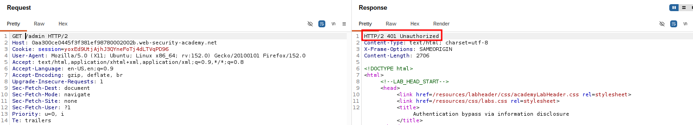

# Information Disclosure via Debug Page

## Summary

The application exposes a publicly accessible debug page that reveals sensitive technical information.

The issue occurs because the debug endpoint is accessible without authentication, allowing an attacker to view application configuration details, including the exposed `SECRET_KEY`.

## Impact

An attacker who obtains the exposed `SECRET_KEY` may be able to compromise application security depending on how the key is used.

For example, if the key is used for signing cookies, authentication tokens, or other security mechanisms, it could potentially lead to unauthorized access.

Additionally, exposed configuration information can help attackers understand the application's internal environment and plan further attacks.

## Steps to Reproduce

1. Navigate to the target application.
2. Perform directory and file enumeration using Feroxbuster.
3. Identify the exposed debug endpoint:

/cgi-bin/phpinfo.php

4. Access the debug page.
5. Review the displayed configuration information.
6. Locate the exposed `SECRET_KEY`.

## Proof of Concept (PoC)

### Burp Suite Request

The request was intercepted using Burp Suite to analyze the application's behavior.

### Admin Endpoint Disclosure

The debug page disclosed the hidden `/admin` endpoint.

### Unauthorized Response

Attempting to access the exposed endpoint without proper authorization resulted in an unauthorized response.

## Remediation

- Disable debug pages in production environments.
- Restrict access to sensitive endpoints.
- Avoid exposing application configuration details publicly.
- Store secrets securely using environment variables or secret management systems.
