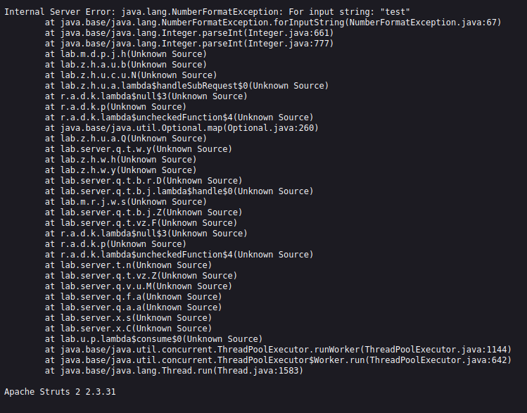

# Information Disclosure via Verbose Error Messages

## Summary

The application discloses sensitive technical information through verbose error messages.

The issue occurs when invalid input is submitted to the `product` parameter, causing the application to return a detailed error response.

The error message reveals internal application details, including the underlying framework and version:

Apache Struts 2.3.31

## Impact

An attacker can use the disclosed framework version to identify publicly known vulnerabilities affecting this specific version.

This information helps attackers understand the application's technology stack and may assist in planning targeted attacks.

## Steps to Reproduce

1. Navigate to the affected page.
2. Intercept the request using Burp Suite.
3. Modify the `product` parameter by submitting invalid input.
4. Send the modified request.
5. Observe the server response.
6. Verify that the error response reveals the framework information:

Apache Struts 2.3.31

## Proof of Concept (PoC)

### Version Disclosure

The error message disclosed the Apache Struts framework version used by the application.

## Remediation

- Disable verbose error messages in production environments.
- Configure the application to return generic error messages to users.
- Avoid exposing framework versions or internal technical details in responses.
