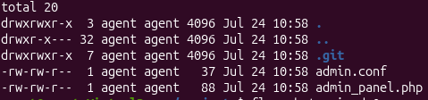

# Information Disclosure via Version Control History

## Summary

The application exposes a publicly accessible Git repository, allowing an attacker to access the application's version control history.

The exposed Git history contains previous versions of configuration files, including sensitive information that was removed from the current version.

By reviewing old commits, an attacker can retrieve the administrator password that was previously hard-coded in the repository.

## Impact

An attacker who gains access to the exposed Git repository can retrieve sensitive information from previous commits.

The disclosed administrator password may allow unauthorized access to administrative functionality, depending on how the credentials are used.

Additionally, exposed source code and version history can reveal internal application details and assist attackers in identifying further vulnerabilities.

## Steps to Reproduce

1. Navigate to the target application.

2. Identify the exposed Git repository:

/.git/

3. Download or retrieve the exposed Git repository using Git analysis tools.

4. Review the Git commit history:

git log -p

5. Identify an old commit containing the removed administrator password.

6. Observe that the previous version of `admin.conf` contains:

ADMIN_PASSWORD=[REDACTED]

7. Verify that the sensitive credential was removed only from the current version but remains available in Git history.

## Proof of Concept (PoC)
### Extracted Repository Files

### Git History Revealing the Removed Password

### Administrative Access

### Disclosed Administrator Password

The screenshot has been redacted to hide sensitive information.

Screenshots showing:

1. The exposed `.git` repository.
2. The recovered repository files.
3. The Git history showing the old commit.
4. The previous commit containing the exposed administrator password.

## Remediation

- Do not commit sensitive credentials to version control systems.
- Remove secrets from Git history if they were accidentally committed.
- Use environment variables or secure secret management systems.
- Restrict access to `.git` directories on production servers.
