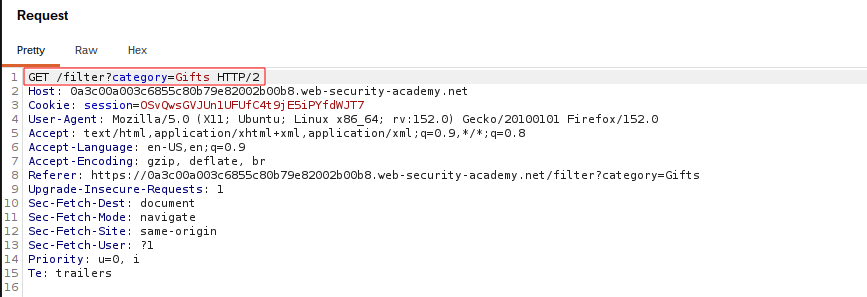
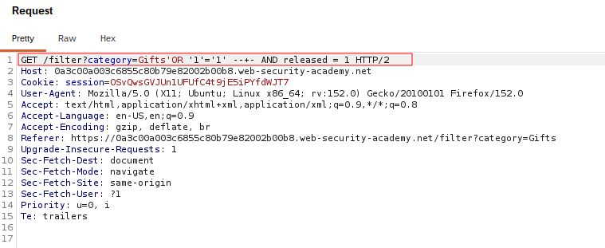

# SQL Injection in WHERE Clause — Retrieving Hidden Data

## Summary

The application is vulnerable to **in-band SQL injection** in the product category filter.

User-controlled input is incorporated directly into a SQL query without proper parameterization. This allows an attacker to modify the query logic and bypass the condition that restricts products to those marked as released.

The original query is:

```sql
SELECT * FROM products WHERE category = 'Gifts' AND released = 1
```

By injecting SQL into the `category` parameter, the `released = 1` condition can be bypassed, causing the application to return unreleased products.

## Impact

An attacker can manipulate the SQL query and access data that the application does not intend to expose.

In this lab, the demonstrated impact is the ability to retrieve **unreleased products**.

## Steps to Reproduce

1. Navigate to the product category filter.
2. Select the `Gifts` category.
3. Identify the `category` parameter as the injection point.
4. Inject the following SQL payload:

```text
Gifts' OR '1'='1'-- -
```

5. Send the request.
6. Observe that previously unreleased products are returned.

## Proof of Concept

### `LAB1.01-original-request.png`



### `LAB1.02-sqli-payload.png`



### `LAB1.03-hidden-data.png`


## Root Cause

The application directly incorporates user-controlled input into the SQL query instead of using parameterized queries or prepared statements.

## Remediation

Use parameterized queries or prepared statements so that user input is treated as data rather than executable SQL.

Additional defensive measures include applying least-privilege database permissions and avoiding detailed database error messages in production.


