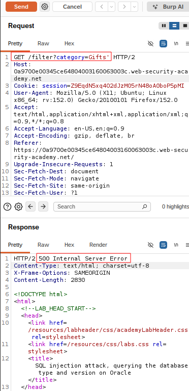
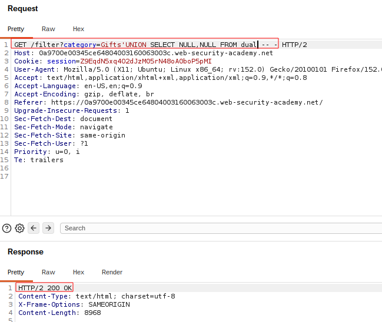
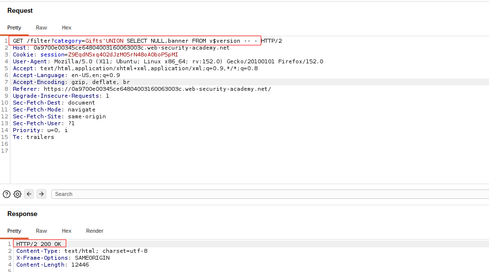
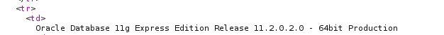

# SQL Injection — UNION Attack: Determining Database Type and Version

## Summary

The application contains a SQL injection vulnerability in the product category filter.

User-controlled input is incorporated directly into an SQL query without proper parameterization. This allows an attacker to modify the query logic and use a `UNION` attack to retrieve information from the database.

In this lab, the objective was to identify the database type and retrieve its version.

## Impact

An attacker can retrieve sensitive database information, including the database type and version. This information can help an attacker identify database-specific behavior and select appropriate techniques for further attacks.

## Steps to Reproduce

1. Navigate to the product category filter.
2. Identify the vulnerable category parameter.
3. Intercept the request using Burp Suite.
4. Determine the number of columns returned by the original query.
5. Identify a column that is compatible with text data.
6. Use a `UNION SELECT` statement to retrieve the database version.
7. Observe the database version in the application's response.

## Proof of Concept

### `LAB2.01-original-request.png`

### `LAB2.02-column-count.png`

### `LAB2.03-version-payload.png`

### `LAB2.04-database-version.png`

## Root Cause

The application directly incorporates user-controlled input into an SQL query instead of using parameterized queries or prepared statements.

## Remediation

Use parameterized queries or prepared statements so that user-controlled input is treated as data rather than executable SQL.

Additional security measures should include applying least-privilege database permissions and avoiding unnecessary exposure of database information.

