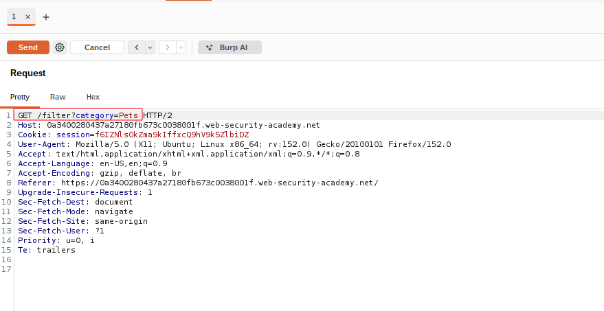
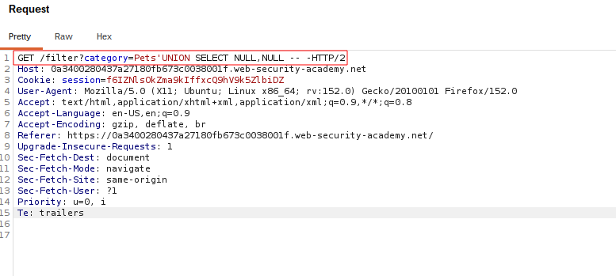
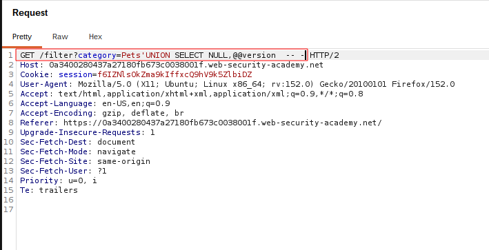
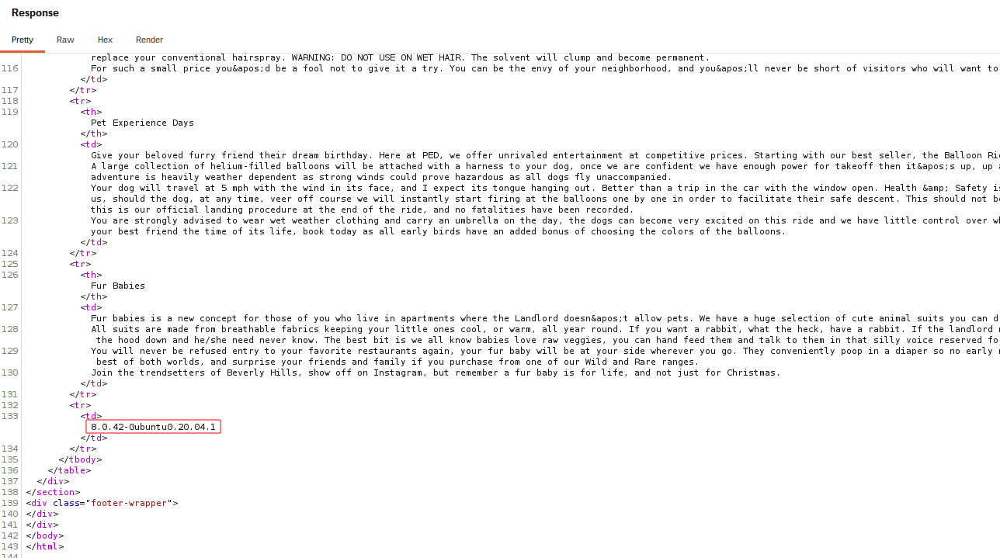

# SQL Injection — UNION Attack: Database Type and Version

## Summary

The application contains a SQL injection vulnerability in the product category filter.

User-controlled input is incorporated directly into an SQL query without proper parameterization. This allows an attacker to modify the query logic and use a `UNION` attack to retrieve information from the database.

In this lab, the objective was to retrieve the database version string.

## Impact

An attacker can retrieve sensitive database information, such as the database type and version. This information can help identify database-specific behavior and support further attacks.

## Steps to Reproduce

1. Navigate to the product category filter.
2. Identify the vulnerable category parameter.
3. Intercept the request using Burp Suite.
4. Determine the number of columns returned by the original query.
5. Identify a column compatible with string data.
6. Use a `UNION SELECT` statement to retrieve the database version.
7. Observe the database version in the application's response.

## Proof of Concept

### Original Request

The original request shows the vulnerable product category parameter before the UNION attack is introduced.

### Column Count

The number of columns returned by the original query is determined so the injected UNION query has a compatible structure.

### Version Payload

A database-specific `UNION SELECT` payload is used to retrieve the version information.

### Database Version

The application's response displays the database version string returned by the injected query.

## Root Cause

The application directly incorporates user-controlled input into an SQL query instead of using parameterized queries or prepared statements.

## Remediation

Use parameterized queries or prepared statements so that user-controlled input is treated as data rather than executable SQL.

Additional security measures include applying least-privilege database permissions and avoiding unnecessary exposure of database information.

