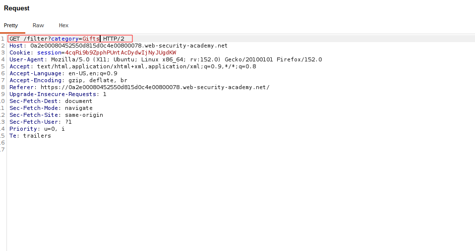
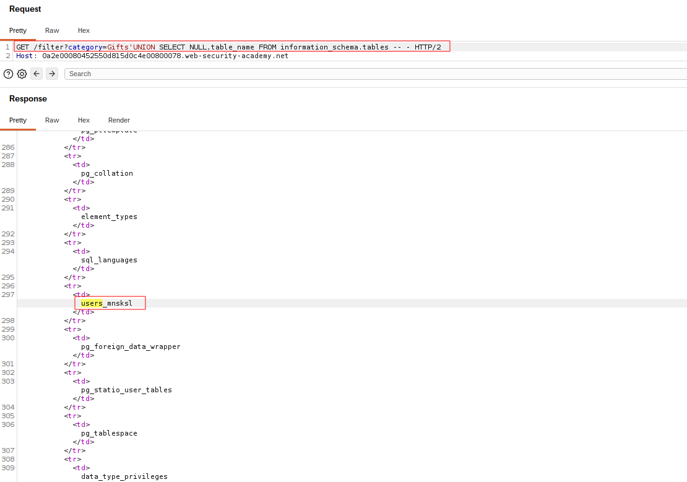
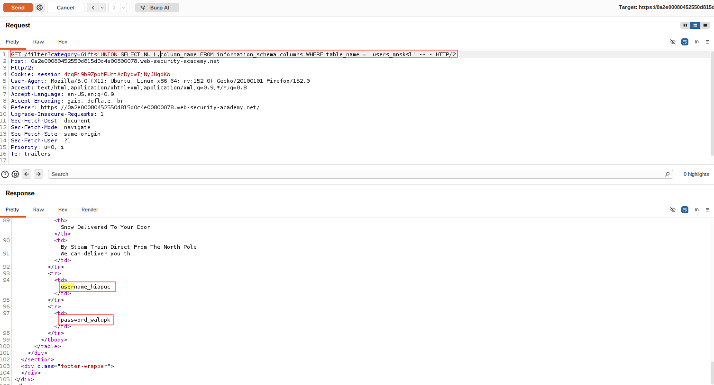
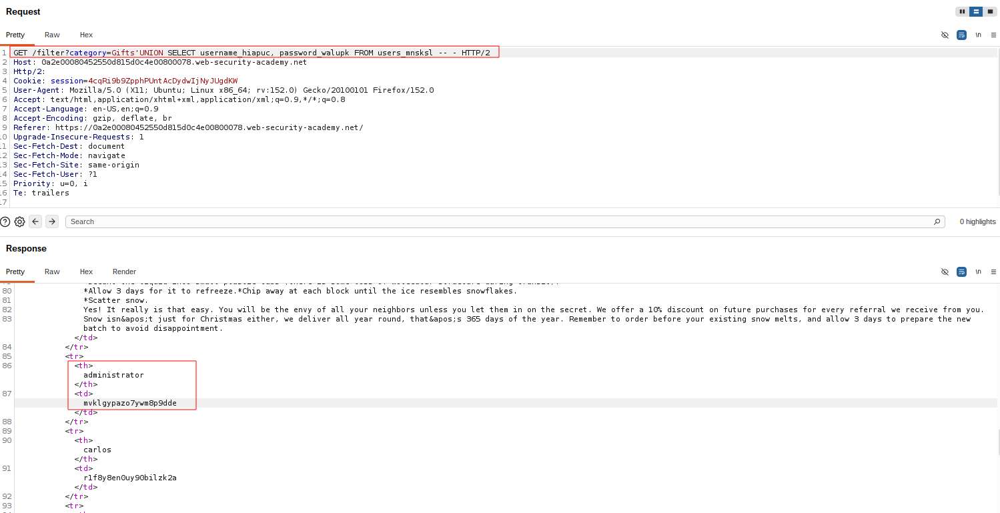
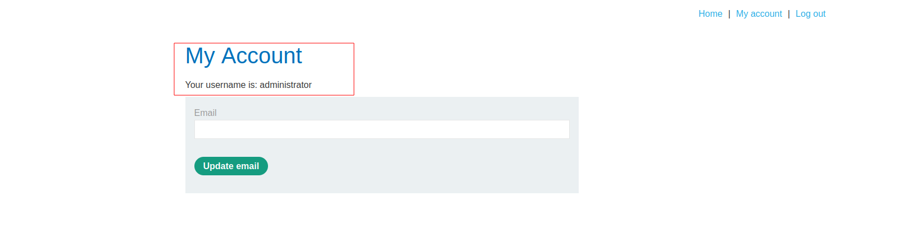

# SQL Injection — Listing Database Contents

## Summary

The application contains a SQL injection vulnerability in the product category filter.

User-controlled input is incorporated directly into an SQL query without proper parameterization. This allows an attacker to use a `UNION` attack to retrieve information from other database tables.

In this lab, the objective was to identify the table containing user credentials, retrieve the usernames and passwords, and use the administrator credentials to log in.

## Impact

An attacker can retrieve sensitive information from database tables, including usernames and passwords. This can lead to unauthorized access to user accounts.

## Steps to Reproduce

1. Navigate to the product category filter.
2. Identify the vulnerable category parameter.
3. Intercept the request using Burp Suite.
4. Determine the number of columns returned by the original query.
5. Identify the relevant database structure.
6. Identify the table containing user credentials.
7. Identify the username and password columns.
8. Use a `UNION SELECT` attack to retrieve the stored credentials.
9. Use the administrator credentials to authenticate to the application.

## Proof of Concept

### Original Request

The original request shows the vulnerable product category parameter before the UNION attack is introduced.

### Database Structure

The database structure is examined to identify the relevant table containing user information.

### Table and Columns

The relevant table and its username and password columns are identified.

### Retrieved Credentials

The UNION attack retrieves the usernames and passwords from the identified table.

### Administrator Login

The retrieved administrator credentials are used to log in to the application.

## Root Cause

The application directly incorporates user-controlled input into an SQL query instead of using parameterized queries or prepared statements.

## Remediation

Use parameterized queries or prepared statements so that user input is treated strictly as data rather than executable SQL.

Database accounts should also follow the principle of least privilege, limiting access to only the data and operations required by the application.

