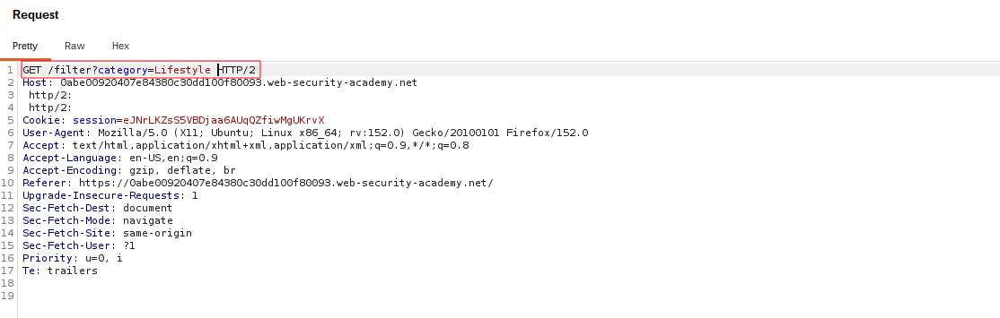
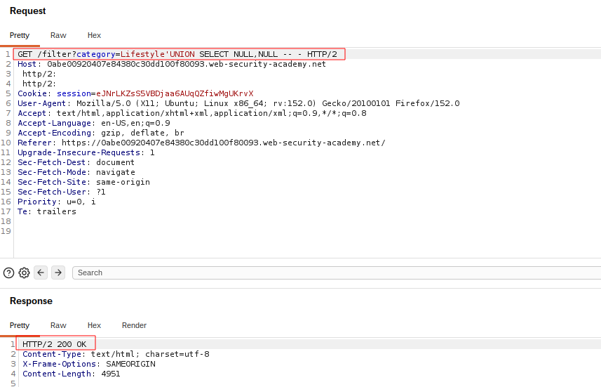
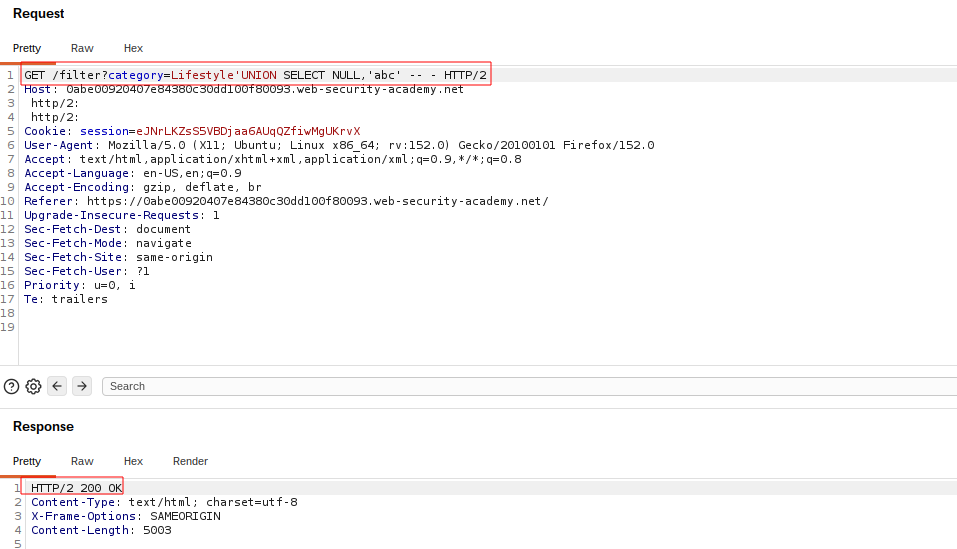
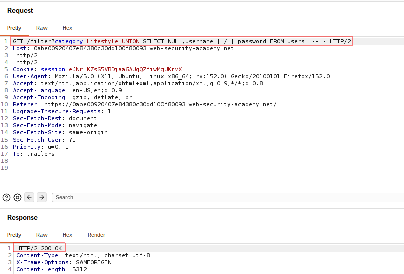
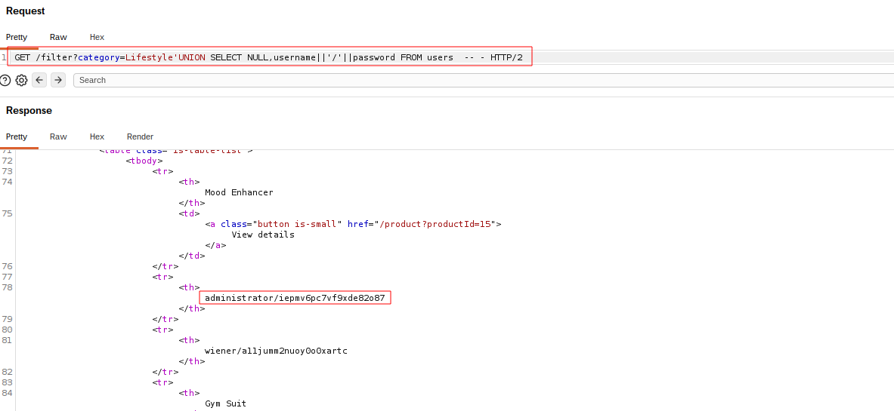

# SQL Injection — UNION Attack: Retrieving Multiple Values in a Single Column

## Summary

The application contains a SQL injection vulnerability in the product category filter.

User-controlled input is incorporated directly into an SQL query without proper parameterization. This allows an attacker to modify the query logic and use a `UNION` attack to retrieve information from other database tables.

In this lab, the objective was to retrieve multiple values, specifically usernames and passwords, through a single column by using string concatenation.

## Impact

An attacker can retrieve sensitive information such as usernames and passwords from the database. This can potentially lead to unauthorized access to user accounts.

## Steps to Reproduce

1. Navigate to the product category filter.
2. Identify the vulnerable category parameter.
3. Intercept the request using Burp Suite.
4. Determine the number of columns returned by the original query.
5. Identify a column compatible with string data.
6. Use string concatenation to combine the username and password into a single column.
7. Retrieve the administrator credentials.
8. Use the retrieved credentials to log in to the administrator account.

## Proof of Concept

### Original Request

The original request shows the vulnerable product category parameter before the UNION attack is introduced.

### Column Count

The number of columns returned by the original query is determined so that the injected UNION query has a compatible structure.

### String Concatenation Payload

String concatenation is used to combine multiple database values into a single column returned by the UNION query.

### Retrieved Credentials

The modified query returns the usernames and passwords through the single compatible column.

### Administrator Login

The retrieved administrator credentials are used to authenticate to the application.

## Root Cause

The application directly incorporates user-controlled input into an SQL query instead of using parameterized queries or prepared statements.

## Remediation

Use parameterized queries or prepared statements so that user-controlled input is treated strictly as data rather than executable SQL.

Apply least-privilege database permissions and avoid exposing sensitive database information through application responses.
