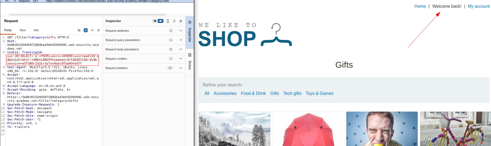
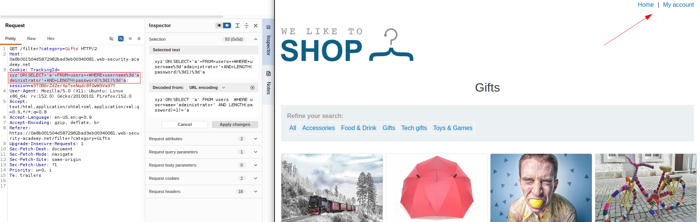
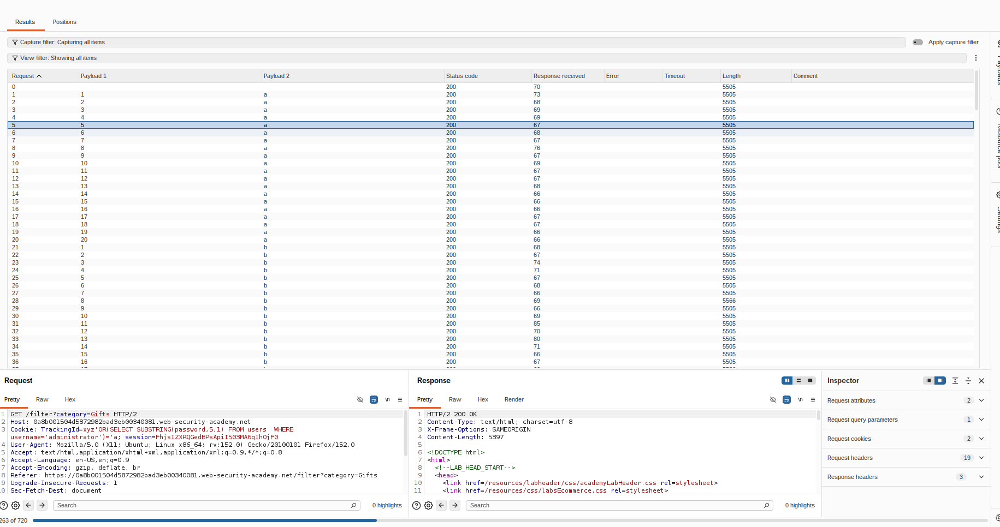

# Blind SQL Injection — Conditional Responses

## Summary

The application contains a blind SQL injection vulnerability in the tracking cookie used for analytics.

The results of the SQL query are not directly returned, but the application displays a `Welcome back` message when the injected condition evaluates to true. This difference in the response can be used to infer information from the database.

## Impact

An attacker can use conditional responses to extract sensitive information from the database, including user credentials.

## Steps to Reproduce

1. Navigate to the target application.
2. Identify the tracking cookie as the injection point.
3. Intercept the request using Burp Suite.
4. Inject a conditional SQL query into the tracking cookie.
5. Observe the application's response.
6. Use the response difference to determine information about the administrator's password.
7. Extract the required password information.
8. Use the recovered credentials to authenticate as the administrator.

## Proof of Concept

### Original Request

The original request contains the tracking cookie before the blind SQL injection is introduced.

### True Condition

The injected condition evaluates to true, causing the application to display the `Welcome back` message.

### False Condition

When the condition evaluates to false, the `Welcome back` message is not displayed, providing a way to distinguish between true and false conditions.

### Password Extraction

By repeatedly testing conditions and observing the application's responses, information about the administrator's password can be extracted.

## Root Cause

The application incorporates user-controlled cookie data directly into an SQL query without using parameterized queries or prepared statements.

## Remediation

Use parameterized queries or prepared statements so that user-controlled input is treated strictly as data.

Apply least-privilege database permissions and avoid exposing database-dependent response differences that could disclose sensitive information.
