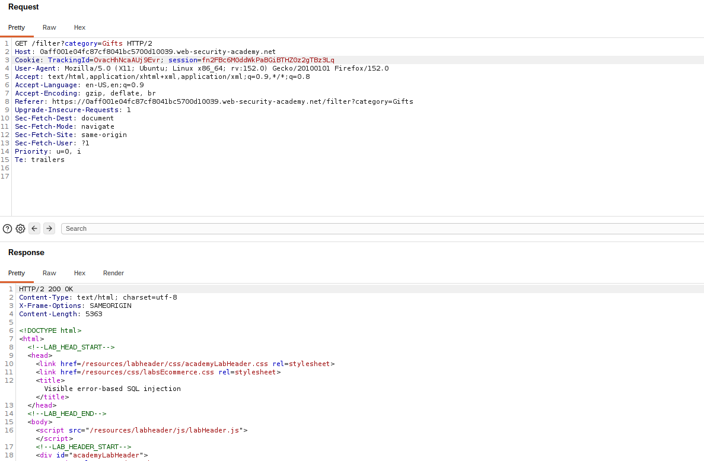
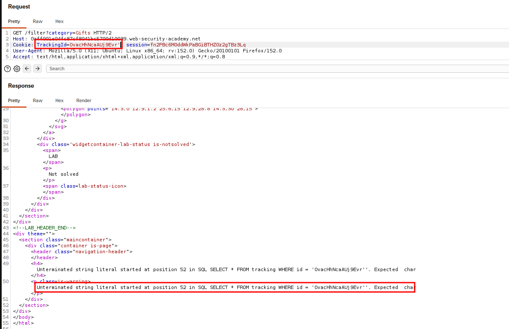
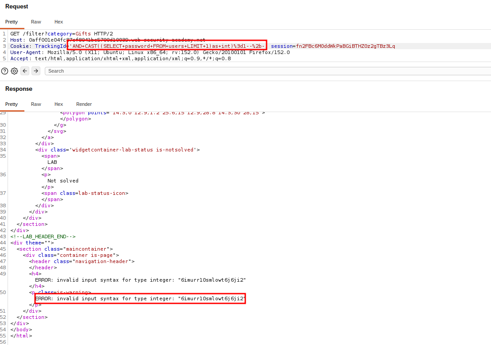

# Blind SQL Injection — Visible Error-Based

## Summary

The application contains a SQL injection vulnerability in the tracking cookie used for analytics.

Although the results of the SQL query are not directly returned, database errors can be triggered through crafted SQL input. These visible errors can be used to infer information from the database.

In this lab, the objective was to use error-based SQL injection to extract the administrator's password.

## Impact

An attacker can exploit database errors to extract sensitive information, including user credentials, potentially leading to unauthorized account access.

## Steps to Reproduce

1. Navigate to the target application.
2. Identify the tracking cookie as the injection point.
3. Intercept the request using Burp Suite.
4. Inject a SQL expression designed to trigger a database error under a specific condition.
5. Observe the application's error response.
6. Use conditional errors to infer information about the administrator's password.
7. Extract the administrator password.

## Proof of Concept

### Original Request

The original request contains the tracking cookie before the error-based SQL injection is introduced.

### Error Message

A crafted SQL expression triggers a visible database error, demonstrating that the injected SQL is being processed by the application.

### Password Extraction

Conditional error responses can be used to infer the administrator's password from the database.

## Root Cause

The application directly incorporates user-controlled cookie data into an SQL query without using parameterized queries or prepared statements.

## Remediation

Use parameterized queries or prepared statements so that user-controlled input cannot alter the SQL query structure.

Database errors should also be handled safely and should not expose detailed database information to users.
