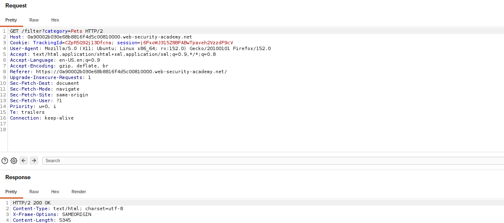
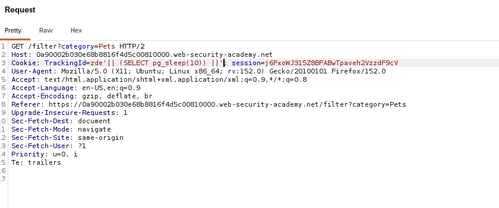

# Blind SQL Injection — Time Delays

## Summary

The application contains a blind SQL injection vulnerability in the tracking cookie used for analytics.

The results of the SQL query are not returned, and the application does not respond differently based on whether the query returns rows or causes an error. However, because the query is executed synchronously, a conditional time delay can be used to demonstrate that injected SQL is being executed.

## Impact

An attacker can potentially use time-based blind SQL injection to infer information from the database when no useful data or error messages are returned directly.

## Steps to Reproduce

1. Navigate to the target application.
2. Identify the tracking cookie as the injection point.
3. Intercept the request using Burp Suite.
4. Modify the tracking cookie with a SQL expression that causes a time delay.
5. Send the request.
6. Observe that the server response is delayed by approximately 10 seconds.

## Proof of Concept

### Original Request

The original request contains the tracking cookie before the time-based SQL injection is introduced.

### Time Delay Payload

A SQL payload is injected into the tracking cookie to trigger a 10-second database delay. The delayed response demonstrates that the injected SQL is being executed.

## Root Cause

The application directly incorporates user-controlled cookie data into an SQL query without using parameterized queries or prepared statements.

## Remediation

Use parameterized queries or prepared statements so that user-controlled input cannot modify the SQL query structure.

Also avoid exposing database behavior through measurable response differences where possible.
