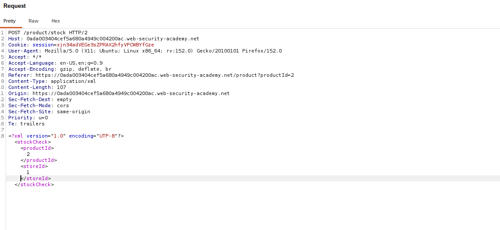
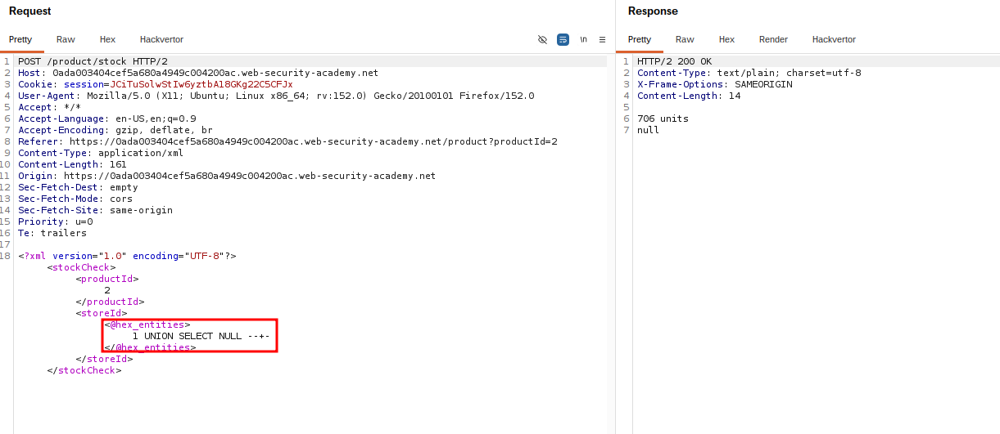
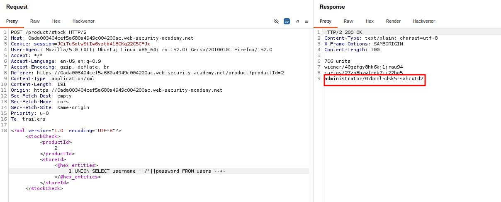
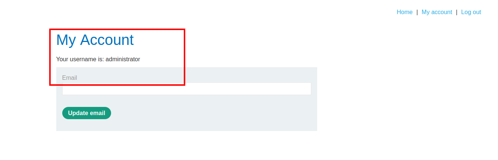

# SQL Injection — Filter Bypass via XML Encoding

## Summary

The application contains a SQL injection vulnerability in the stock check feature.

The application processes XML input containing user-controlled data and incorporates that data into an SQL query. An XML encoding technique can be used to bypass the input filter and deliver the SQL injection payload.

In this lab, the objective was to retrieve the administrator's credentials and use them to log in to the application.

## Impact

An attacker can bypass input filtering and exploit the underlying SQL injection vulnerability to retrieve sensitive information, including usernames and passwords.

## Steps to Reproduce

1. Navigate to the stock check feature.
2. Identify the user-controlled XML parameter.
3. Intercept the request using Burp Suite.
4. Identify the filtering applied to the SQL injection payload.
5. Encode the required part of the SQL payload using XML encoding.
6. Send the modified request.
7. Retrieve the administrator credentials from the application's response.
8. Use the recovered credentials to authenticate as the administrator.

## Proof of Concept

### Original Request

The original request shows the stock check request before the SQL injection payload is introduced.

### Encoded SQL Injection Payload

The SQL injection payload is encoded within the XML request to bypass the input filter while preserving its intended meaning when processed by the application.

### Retrieved Credentials

The modified request successfully bypasses the filter and retrieves the administrator credentials from the database.

### Administrator Login

The retrieved administrator credentials are used to authenticate to the application.

## Root Cause

The application relies on input filtering as a security control while incorporating user-controlled XML data into an SQL query without proper parameterization.

## Remediation

Use parameterized queries or prepared statements so that user-controlled input cannot modify the SQL query structure.

XML input should also be parsed securely, and security controls should be applied to the underlying SQL operation rather than relying solely on input filtering.
